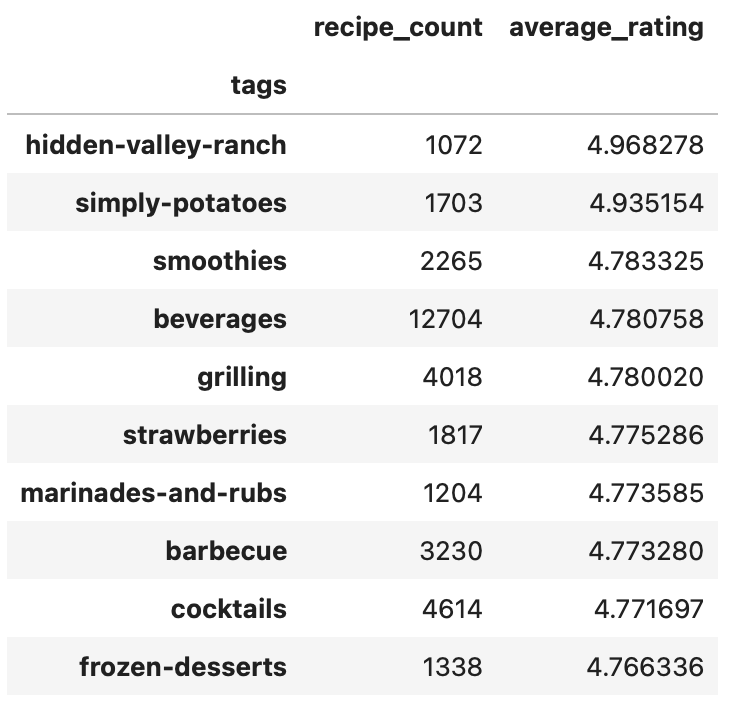
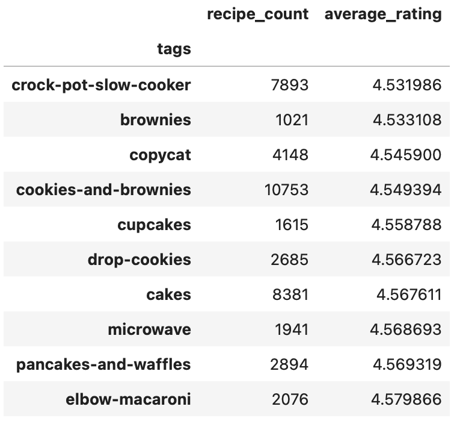

# What Makes a Recipe Highly Rated?

Nathaniel Djapri

## Introduction

The dataset contains recipes and user ratings from Food.com. Each row represents a recipe, along with information about its ingredients, preparation, description, tags, and user ratings.

The main question my project is centered around is: **Do recipes with specific tags tend to get better ratings?** Understanding this relationship can help me identify whether certain characteristics or categories associated with recipes are related to how highly users rate them.

The dataset contains **83,782 recipes**. The columns most relevant to our analysis are:

- **`tags`** — tags describing characteristics or categories associated with a recipe.
- **`avg_rating`** — the average user rating for each recipe.
- **`minutes`** — the amount of time required to prepare the recipe.
- **`ingredients`** — the ingredients used in the recipe.
- **`description`** — the written description of the recipe.

These variables are used to explore the patterns in recipe ratings and investigate whether recipes associated with particular tags tend to receive higher ratings.

## Data Cleaning and Exploratory Data Analysis

### Data Cleaning

The recipe data was first combined with the user interaction data so that each recipe could be analyzed together with its ratings. The interaction data contains user ratings, while the recipe data contains information such as ingredients, preparation time, tags, and descriptions.

Any rating of `0` is replaced with `NaN` so that it would not incorrectly lower the average rating of a recipe. This is done because a rating of `0` does not represent a genuine zero-star rating in this dataset. Instead, it indicates that a rating was not provided.

The average rating was then calculated for each recipe using its available user ratings, and this value was added to the recipe dataset as `avg_rating`. The `tags` column was also converted into lists so that individual tags could be analyzed across recipes.

After cleaning and calculating average ratings, **81,173 recipes had an available average rating**.

The following cleaned variables were used throughout the analysis:

- `avg_rating` — the average rating received by a recipe.
- `n_ingredients` — the number of ingredients used in a recipe.
- `minutes` — the preparation time in minutes.
- `tags` — descriptive tags associated with each recipe.
- `description` — the written description of each recipe.

### Univariate Analysis

The distributions of average recipe ratings and number of ingredients were examined separately.

#### Average Rating

<iframe
src="assets/avg_rating_histogram.html"
width="800"
height="600"
frameborder="0"
></iframe>

The distribution of average ratings is heavily concentrated at the upper end of the rating scale. The mean rating is **4.63**, while the median is **5.0**, and 75% of recipes have a rating of 5.0. This indicates that recipes in the dataset generally receive very high ratings, with relatively few recipes receiving ratings below 4.

#### Number of Ingredients

<iframe
src="assets/n_ingredients_histogram.html"
width="800"
height="600"
frameborder="0"
></iframe>

The number of ingredients is concentrated around relatively small values. A recipe uses an average of **9.21 ingredients**, with a median of **9 ingredients**, while the middle 50% of recipes use between **6 and 11 ingredients**. The distribution is right-skewed, with a smaller number of recipes using substantially more ingredients, reaching as high as 37.

### Bivariate Analysis

Relationships between pairs of variables were examined to identify possible associations with recipe ratings.

#### Number of Ingredients vs. Average Rating

<iframe
src="assets/ingredients_vs_rating.html"
width="800"
height="600"
frameborder="0"
></iframe>

There does not appear to be a strong relationship between the number of ingredients and average rating. Recipes with both few and many ingredients can receive high or low ratings, suggesting that the number of ingredients alone may not be a strong predictor of recipe ratings.

#### Recipe Tags vs. Average Rating

<iframe
src="assets/top_tags_boxplot.html"
width="800"
height="600"
frameborder="0"
></iframe>

The distributions of average ratings are similar across the most common recipe tags, with most recipes receiving ratings near 4.5–5.0. Although some tags have slightly different distributions, there is no large difference in ratings across these common categories.

### Interesting Aggregates

Recipes were grouped by their tags, and both the number of recipes and average rating were calculated.

#### Top 10 Highest-Rated Tags

#### Top 10 Lowest-Rated Tags

The grouped tables show that average ratings differ somewhat across recipe tags. The highest-rated tags have average ratings between about 4.77 and 4.97, with `hidden-valley-ranch` having the highest average rating at 4.97. The lowest-rated tags shown have average ratings between about 4.53 and 4.58, with `crock-pot-slow-cooker` having the lowest average rating at 4.53. Overall, the differences are relatively small, suggesting that recipe tags may be associated with ratings, but the tag alone does not determine whether a recipe receives a high rating.

## Assessment of Missingness

### MNAR Analysis

The `avg_rating` column contains missing values. I believe that the missingness in `avg_rating` may be MNAR (Missing Not At Random). A possible explanation is that recipes are missing ratings because they have received too few ratings from users. Since the number of ratings a recipe receives may be related to its popularity or quality, the reason that a rating is missing could depend on the unobserved rating value itself.

However, we are unable to determine with certainty whether `avg_rating` is truly MNAR using only the observed dataset. Additional information about the rating collection process, such as whether recipes require a minimum number of ratings before an average rating is displayed, would help verify the missingness mechanism.

### Missingness Dependency

To investigate whether the missingness of `avg_rating` depends on other variables, permutation tests were performed. Specifically, the distributions of variables between recipes were compared with the missing and non-missing `avg_rating` values.

First, I tested whether missingness in `avg_rating` depends on the `minutes` column. The observed difference in average preparation time between recipes with missing and non-missing ratings was approximately 122.7 minutes.

After performing 1000 permutation simulations, a p-value of 0.023 was obtained. Since this p-value is less than 0.05, we reject the null hypothesis that missingness in `avg_rating` is independent of `minutes`. This suggests that the missingness of `avg_rating` depends on recipe preparation time.

<iframe
src="assets/minutes_perm.html"
width="800"
height="600"
frameborder="0"
></iframe>

Next, I also tested whether missingness in `avg_rating` depends on the length of the recipe description. The observed difference in average description length between recipes with missing and non-missing ratings was approximately -5.92 characters.

The permutation test produced a p-value of 0.145. Since this p-value is greater than 0.05, we fail to reject the null hypothesis that missingness in `avg_rating` is independent of description length. Therefore, we do not find sufficient evidence that the missingness of `avg_rating` depends on description length.

<iframe
src="assets/description_perm.html"
width="800"
height="600"
frameborder="0"
></iframe>

## Hypothesis Testing

### Research Question

I investigated whether recipes tagged as "easy" have different average ratings compared to recipes that are not tagged as "easy".

### Hypotheses

The null hypothesis (H_0) is that there is no difference in the average rating between easy recipes and non-easy recipes.

The alternative hypothesis (H_A) is that there is a difference in the average rating between easy recipes and non-easy recipes.

### Permutation Test

To test this hypothesis, I performed a permutation test using the difference in mean average ratings between the two groups as the test statistic. This statistic was chosen because the question compares the average ratings of two groups.

The significance level was set to alpha = 0.05. The observed difference in average rating between easy and non-easy recipes was approximately 0.0109, with easy recipes having a slightly higher average rating.

The permutation test produced a p-value of 0.0. Since the p-value is less than the significance level of 0.05, I reject the null hypothesis.

This suggests that there is statistically significant evidence of a difference in average ratings between easy and non-easy recipes. However, the difference in average rating is relatively small, indicating that being tagged as "easy" is associated with only a slight difference in ratings.

<iframe
src="assets/easy_perm.html"
width="800"
height="600"
frameborder="0"
></iframe>

## Framing a Prediction Problem

The prediction problem is to predict the average rating (`avg_rating`) of a recipe using information available at the time of prediction.

This is a regression problem because the response variable, `avg_rating`, is a continuous numerical value.

The response variable was chosen because it represents how well a recipe is received by users. The model only uses information available before the rating is observed to avoid data leakage.

The model will be evaluated using Root Mean Squared Error (RMSE), which measures the magnitude of prediction errors while penalizing larger errors more strongly. RMSE is appropriate here because the goal is to predict a numerical value rather than assign categories.

## Baseline Model

The baseline model predicts the average rating (`avg_rating`) of a recipe using two features: `minutes` and `n_ingredients`. Both features are quantitative variables representing the preparation time and number of ingredients in a recipe.

The model uses a Linear Regression model implemented in a sklearn Pipeline. Before training, the features are standardized using StandardScaler to ensure that both features are on a comparable scale. No categorical encoding was required because both selected features are numerical.

The dataset was split into training and testing sets using an 80/20 split. The model was evaluated using Root Mean Squared Error (RMSE), which measures the average magnitude of prediction errors.

The baseline model achieved an RMSE of approximately 0.49 on the test set. This means that the model's predictions are typically off by about 0.49 rating points. While this provides a pretty reasonable starting point, the model only currently uses two simple recipe features, so additional feature engineering may improve its ability to predict ratings.

## Final Model

The final model adds two engineered features to the baseline model: `is_easy` and `is_quick`. These features indicate whether a recipe is tagged as "easy" or "30-minutes-or-less". These tags provide additional information about the recipe's difficulty and preparation time, which may have an influence on user ratings.

The final model uses Ridge Regression with StandardScaler in a sklearn Pipeline. Ridge Regression was chosen because it can reduce the impact of unnecessary feature weights and help prevent overfitting. The regularization parameter, alpha, was tuned using GridSearchCV with 5-fold cross-validation. The best value of alpha was 100.

The final model achieved an RMSE of approximately 0.4899 on the test set, which is a slight improvement over the baseline model's RMSE of approximately 0.4900. This indicates that the additional features provided a small improvement in predicting average recipe ratings.

## Fairness Analysis